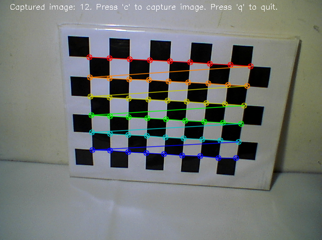
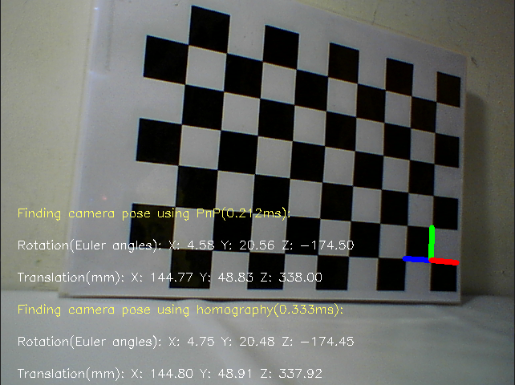

# Scripts of camera calibration using OpenCV

This repository conatins scripts for performing camera calibration using chessboard. Most scripts are modified from OpenCV-Python tutorials. You can refer to those tutorials to find more useful information. To calibrate camera using these scripts, you need to prepare a chessboard and change the settings in the scripts. The collect\_images.py script is used to collect images. And then calibration is performed by invoking the calibrate\_camera.py script. With the calibration result, the camera pose with respect to the chessboard can be calculated using the camera\_pose\_from\_chessboard\_live\_test.py or camera\_pose\_from\_chessboard\_offline\_test.py script.

